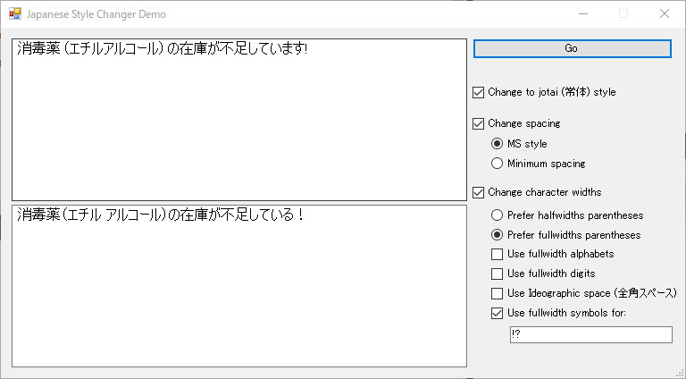

JapaneseStyleChanger
====================
An experimental library to rewrite Japanese texts using MeCab

JapaneseStyleChanger is an experimental .NET class library built on top of [NMeCab](https://github.com/komutan/NMeCab) and [UniDic](https://github.com/AlissaSabre/Alissa.UniDic-CWJ.binary) to rewrite and/or adjust styles of Japanese texts.
It is currently in a very preliminary stage, though it might be usable for some purposes.

For the moment it can, in some extent,
- rewrite Japanese honorific style (敬体) sentences into plain style (常体) sentences,
- adjust spacing between words based on either of the two major style guidelines, and
- turn some characters to corresponding fullwidth (全角) version.

A simple demonstration program (written using Windows Forms) is included.

Have fun!

Alissa Sabre

## Legalease

- JapaneseStyleChanger uses UniDic-CWJ, the analysis dictionary for the morphological analizer MeCab, copyright The UniDic Consortium
- JapaneseStyleChanger uses NMeCab, a .NET port of the analysis libray of MeCab: Yet Another Part-of-Speech and Morphological Analyzer by Taku Kudo, copyright Taku Kudo and Nippon Telegraph and Telephone Corporation

THE JAPANESESTYLECHANGER IS PROVIDED "AS IS" AND THE AUTHOR DISCLAIMS ALL WARRANTIES WITH REGARD TO THIS SOFTWARE INCLUDING ALL IMPLIED WARRANTIES OF MERCHANTABILITY AND FITNESS. IN NO EVENT SHALL THE AUTHOR BE LIABLE FOR ANY SPECIAL, DIRECT, INDIRECT, OR CONSEQUENTIAL DAMAGES OR ANY DAMAGES WHATSOEVER RESULTING FROM LOSS OF USE, DATA OR PROFITS, WHETHER IN AN ACTION OF CONTRACT, NEGLIGENCE OR OTHER TORTIOUS ACTION, ARISING OUT OF OR IN CONNECTION WITH THE USE OR PERFORMANCE OF THIS SOFTWARE.
